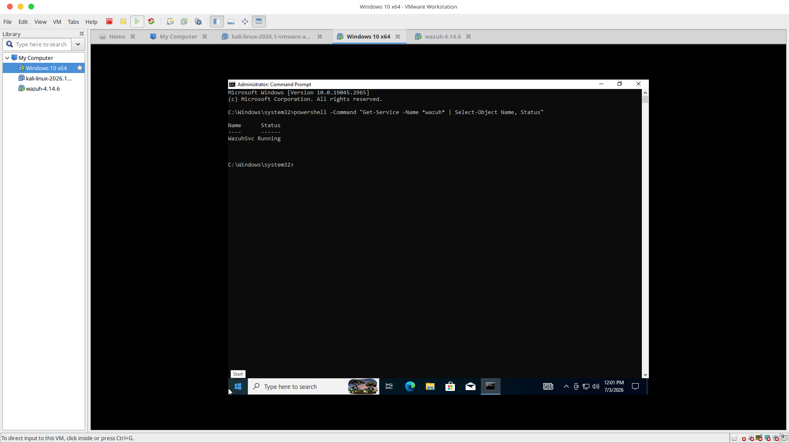
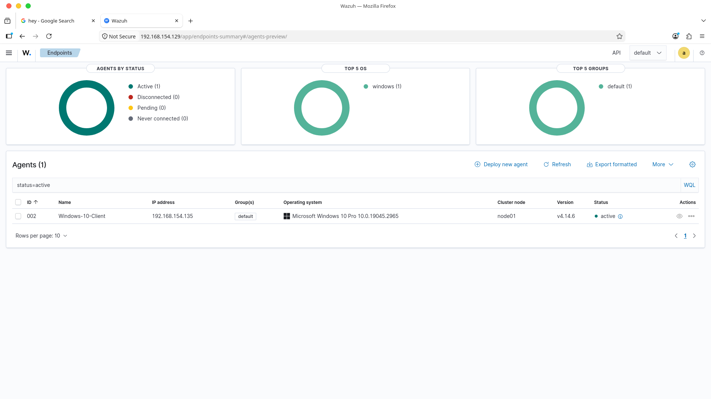
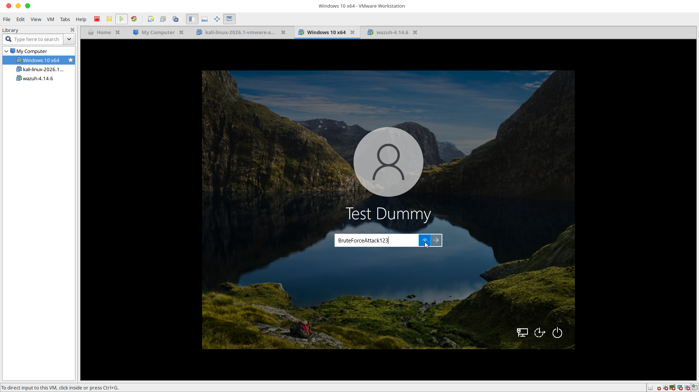
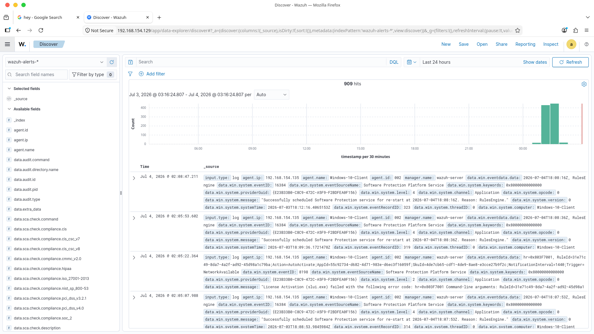

# 🛡️ Wazuh SIEM Endpoint Monitoring & Log Analytics Toolkit

## 📊 Infrastructure & Telemetry Classification
* **Domain Focus:** Security Operations Center (SOC) Operations & Blue Team Defenses
* **Core Competencies:** Threat Monitoring, Security Event Log Triage, Adversary Attack Simulation

### 🖥️ Enterprise Lab Environment Architecture
* **Central SIEM Orchestrator:** 
  * **Platform:** Wazuh OVA Distributed Virtual Machine Node (Pre-configured SIEM Server Architecture)
  * **Role:** Aggregates, indexes, and visualizes security event logs streamed across endpoint channels.
* **Domain Infrastructure Controller:** 
  * **Platform:** Windows Server 2019 (Enterprise Systems Directory Infrastructure)
  * **Role:** Manages centralized directory resources, security policies, and enterprise domain state logging.
* **Target Security Endpoint Node:** 
  * **Platform:** Windows 10 Pro (x64 Workstation Client Node)
  * **Role:** Monitored corporate workstation generating localized user authentication events (Event ID 4625).

---

## 📝 Project Overview
This repository documents the architectural installation, configuration, and practical application of a centralized Wazuh SIEM dashboard workspace environment. Telemetry was aggregated by deploying a dedicated endpoint security agent onto a target Windows Enterprise workspace node. 

By simulating an active brute-force threat (Event ID 4625), raw telemetry data blocks were ingested across secure communication channels, mapped against global threat matrix frameworks, and manually triaged within the analytics panel view. This setup demonstrates real-world SOC event aggregation, rule trigger handling, and event payload parsing.

---

## 🚀 Step-by-Step Methodology

### 1️⃣ Phase 1: Client Host & Service Integrity Verification
1. Accessed the target endpoint machine and initialized verification diagnostics across local infrastructure services.
2. Verified the active deployment status of the Wazuh endpoint daemon listener natively inside the system command prompt terminal to ensure persistent log capture channels remained active and error-free.

### 2️⃣ Phase 2: Agent Telemetry Registration & Baseline Mapping
1. Established a secure link handshake connection between the remote target asset node and the centralized SIEM manager dashboard.
2. Verified the telemetry status grid inside the main web management canvas console to confirm that the endpoint node was registered, actively checking in, and successfully streaming real-time event pipeline logs.

### 3️⃣ Phase 3: Simulated Adversary Threat Execution (Brute Force)
1. Simulated an active credential-stuffing / brute-force attack path sequence directly on the target machine endpoint interface gateway.
2. Intentionally triggered multiple failed authentication attempts to force the Windows security logging subsystem to generate explicit system failure logs.

### 4️⃣ Phase 4: Real-Time Event Triage & Log Volume Analysis
1. Monitored the central SIEM manager analytics engine console dashboard framework view.
2. Identified an immediate, massive anomaly spike running up across the security event log tracking charts, signaling an active authentication failure event wave.

### 5️⃣ Phase 5: Deep-Dive Event Payload Parsing (Windows Event ID 4625)
1. Clicked into the alert matrix layout grid to isolate the raw security event metadata payload block container fields.
2. Executed text search queries to parse the critical log elements, auditing the precise **Windows Event ID 4625** (An account failed to log on) details.
3. Successfully extracted forensic attack artifacts, including the targeted username string fields, source IP connection vectors, and explicit failure reason codes.

---

## 📸 Technical Portfolio Artifacts

* **Wazuh Service Status Verification:**  
    
  *Displays the active runtime check confirming the endpoint agent is up and tracking events from the system command console.*

* **Manager Agent Connectivity Grid:**  
    
  *Displays the central management interface tracking a healthy, successfully connected endpoint agent streaming telemetry logs.*

* **Adversary Authentication Simulation:**  
    
  *Displays the entry point of the simulated brute-force threat execution sequence on the host interface gate portal.*

* **SIEM Incident Volume Alert Spike:**  
    
  *Displays the immediate, visual log spike chart indicator firing inside the SIEM dashboard console as the security alert triggers.*

* **Deep-Dive Event Log Payload Audit (Event ID 4625):**  
    
  *Displays the final parsed metadata field container breakdown detailing the malicious source IP address, target user name, and authentication failure reason codes.*

---

## 🛡️ Key Takeaways & SOC Incident Insights
* **High-Fidelity Log Identification:** Leveraged Windows Event ID 4625 signatures to cleanly separate automated brute-force attack attempts from standard user profile typos based on alert volume frequency thresholds.
* **Telemetry Data Integrity:** Proved that secure endpoint logging daemons running quietly inside background host environments can seamlessly pipe rich forensics data past network border partitions without disruption.
* **Forensic Artifact Triage:** Mastered the workflow of diving straight past generic alert warnings down into raw log fields to harvest critical indicators of compromise (IOCs) needed to build defense blocks rapidly.
